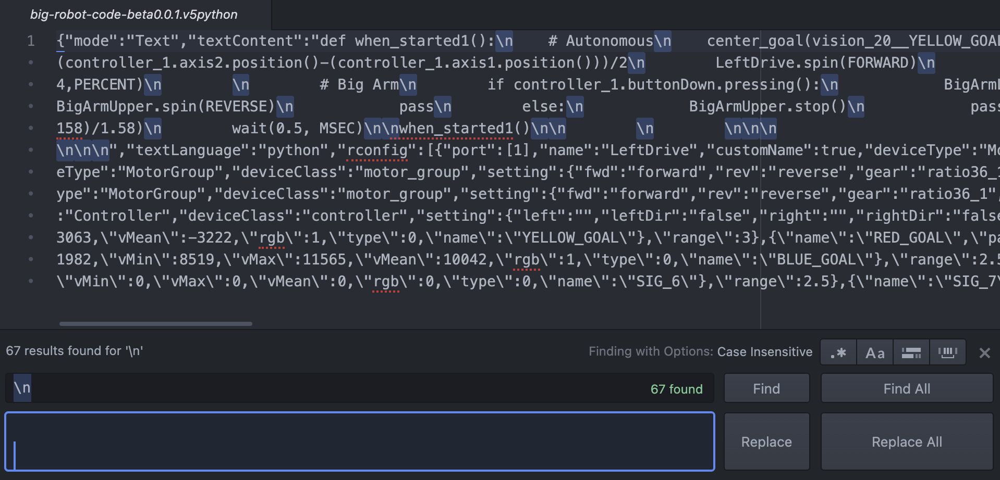
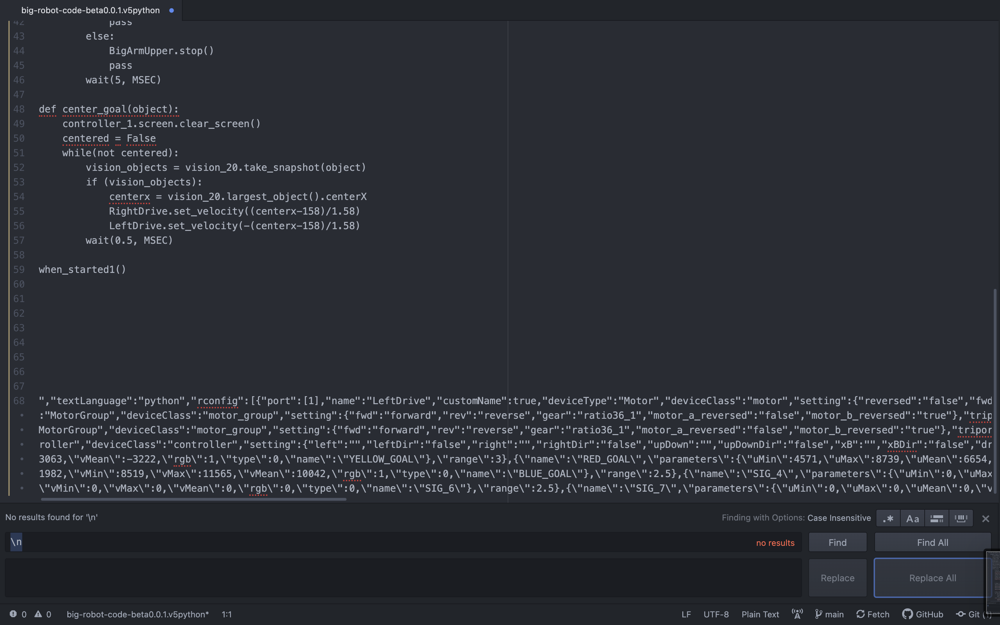

# Big Robot Code

## Overview
This repository contains all of the versions of the robot code for the Large 24x24x24 robot. Most is written in VEX V5 Python using the VEX V5 editor.

### Code Naming and Numbering
We will not be updating individual files after they are published, but will instead be creating a new file as the next beta until out final code which will be labelled as version 1.0.0.

### List of files and usabillity
| File | Status | Notes | Date |
| ----------- | ----------- | ----------------------------------------- | ----------- |
| [big-robot-code-beta.0.0.1.v5python](https://github.com/Roobotics-5/Big-Robot-Code/blob/main/big-robot-code-beta0.0.1.v5python) | DEPRECIATED | Original robot code, basic center goal function that over-corrects sometimes | 10/12/2021 |
| [big-robot-code-beta.0.0.2.v5python](https://github.com/Roobotics-5/Big-Robot-Code/blob/main/big-robot-code-beta0.0.2.v5python) | DEPRECIATED | Updated center-goal function to be more accurate and work better | 10/19/2021 |
| [big-robot-code-beta.0.0.3.v5python](https://github.com/Roobotics-5/Big-Robot-Code/blob/main/big-robot-code-beta0.0.3.v5python) | CURRENT | Added manual interrupt to big-robot code and added two motors to the drive train | 11/2/2021 |
| [big-robot-code-beta.0.1.0.v5python](https://github.com/Roobotics-5/Big-Robot-Code/blob/main/big-robot-code-beta0.1.0.v5python) | TESTING | Begin testing for the Autonomous period. Will be graphing true distance vs rotations on the wheels of the robot and creating algorithms based on which goal we want to grab using these raw polars, the visions sensor's ability to locate items, and the locations of things on the playing field | 11/2/2021 |

## Working with the .v5python
The code contained here is written in python using the VEXcode V5 software. The code consists of two parts - the actual code, and the setup parameters. These parameters are stored at the bottom in what looks like json, containing all the calibrations for the motors, controllers, and sensors.

If you open the code in any editor other than VEXcode V5, it will not be viewable (it will all be one line). To make it viewable, replace "\n" with a newline character.

### Example using Atom
Image of the text before seperation

Image of the text after seperation

### Calibration
Note the block of brackets and names at the bottom, which is the aforementioned calibration. This is where many of the variables are declared and defined. The motors and controllers are fairly obvious how they work (just declare it, and the code handles the rest). Sensors are more complex.
#### Sensor calibration
In the image sensor, the u and v values are between 0 and 16000 and do not translate to regular rgb colors. You have to calibrate them using the VEX provided software.
Each of the other vex sensors are similarly encoded, and must therefor be interpreted by the VEX software or libraries.

----

### Authors
Tobias Ward
